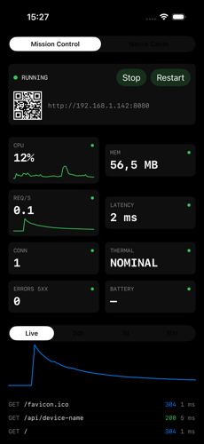
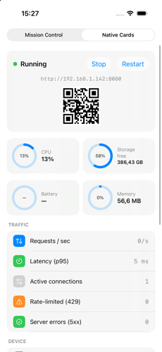

# Web track: on-device dashboard (`SwiftCoreWebDashboard`)

[← docs index](../README.md)

You are here if: you want the device's own screen to show a live console for the server running on
it, instead of (or alongside) whatever your app would otherwise show.

Turns the device's own screen into a live console for the server running on it — request rate,
latency, CPU/memory/battery/thermal state, connection log.

- Separate library target, opt-in: the core `SwiftCoreWeb` package has no SwiftUI in it
- `/` keeps serving `www/index.html` to browsers exactly as before
- Not a build-time choice either — the visual style switches at runtime and the choice is remembered

Read this section top to bottom the first time; it's laid out as a short course, each part builds
on the last. Skip to a lesson once you know what you're after.

**Index**
1. [Add the dependency](#1-add-the-dependency)
2. [Minimal setup — one line](#2-minimal-setup--one-line)
3. [Picking a look: Mission Control vs Native Cards](#3-picking-a-look-mission-control-vs-native-cards)
4. [Configuring history retention](#4-configuring-history-retention)
5. [Driving the model yourself (custom UI, tests, shared state)](#5-driving-the-model-yourself-custom-ui-tests-shared-state)
6. [Opt-in HTTP metrics endpoint](#6-opt-in-http-metrics-endpoint)
7. [The web side keeps working: serving pages alongside the dashboard](#7-the-web-side-keeps-working-serving-pages-alongside-the-dashboard)
8. [What's not there, on purpose](#8-whats-not-there-on-purpose)

### 1. Add the dependency

```swift
// Package.swift
.target(
    name: "YourApp",
    dependencies: [
        "SwiftCoreWeb",
        "SwiftCoreWebDashboard", // adds SwiftUI + system libsqlite3, nothing else
    ]
)
```

### 2. Minimal setup — one line

The whole point: your app already builds a `WebApplication`. Hand it to the dashboard view instead
of building your own screen.

```swift
import SwiftUI
import SwiftCoreWeb
import SwiftCoreWebDashboard

struct RootView: View {
    let app: WebApplication // however you already build/hold it

    var body: some View {
        SwiftCoreWebDashboardView(app: app)
    }
}
```

That's it. This one line: opens (or creates) the on-disk metrics history, samples device health at
1 Hz, and shows whichever style (Mission Control / Native Cards) the user last picked — default
`nativeCards` on first launch. No further config needed to see it working.

### 3. Picking a look: Mission Control vs Native Cards

Both styles ship built-in; a segmented control in the dashboard itself lets the person using the
device switch between them at runtime, no relaunch.

| Mission Control | Native Cards |
|:---:|:---:|
|  |  |

You don't choose one in code — but you can read or force the stored choice, e.g. to default kiosk
hardware to the dense NOC-style view:

```swift
import SwiftCoreWebDashboard

// Read what's currently picked (persisted in UserDefaults):
let current = DashboardStyle.stored // .missionControl or .nativeCards

// Force a default before the dashboard ever appears — useful for a kiosk
// build that always wants the dense, wall-readable style:
DashboardStyle.stored = .missionControl
```

`DashboardStyle.stored` is just a `UserDefaults`-backed property — setting it before
`SwiftCoreWebDashboardView` appears changes what the person sees on first launch; they can still
switch it from the UI afterwards.

### 4. Configuring history retention

Default retention is 24h at 1-minute resolution, 7 days hourly, 30 days daily (bounds the on-disk
SQLite file to roughly 1440+168+30 rows). Pass a `DashboardConfiguration` if your app needs
shorter/longer windows — e.g. a demo unit that only needs a few hours of history:

```swift
import SwiftCoreWebDashboard

let shortHistory = DashboardConfiguration(
    minuteRetentionSeconds: 2 * 3600,   // 2h of minute-level history…
    hourRetentionSeconds: 24 * 3600,    // …1 day hourly…
    dayRetentionSeconds: 7 * 24 * 3600  // …1 week daily
)

SwiftCoreWebDashboardView(app: app, configuration: shortHistory)
```

### 5. Driving the model yourself (custom UI, tests, shared state)

`SwiftCoreWebDashboardView` owns its `DashboardModel` privately — fine for "just show the
dashboard", not enough if you need to inject a fake history for a test, or show the same live data
in a second view. Build the model yourself and use `DashboardRootView` instead:

```swift
import SwiftUI
import SwiftCoreWeb
import SwiftCoreWebDashboard

@MainActor
struct CustomDashboardHost: View {
    @State private var model: DashboardModel?
    let app: WebApplication

    var body: some View {
        Group {
            if let model {
                DashboardRootView(model: model)
            } else {
                ProgressView()
            }
        }
        .task {
            // withDefaultHistory opens the real on-disk SQLite store;
            // pass `history: nil` (via `DashboardModel(app:history:)`) in a
            // test target instead, and the dashboard runs live-only, no crash.
            let model = await DashboardModel.withDefaultHistory(app: app)
            model.startSampling()
            self.model = model
        }
    }
}
```

`model.latestServer` / `model.latestDevice` are `@Published` — read them directly if you're
building your own tile instead of using the shipped views.

### 6. Opt-in HTTP metrics endpoint

Everything above stays on the device screen. If you also want the same numbers reachable over HTTP
(e.g. for your own monitoring, or a second device polling this one), opt in explicitly — it's never
registered unless you call it:

```swift
import SwiftCoreWeb
import SwiftCoreWebDashboard

// JSON at GET /_metrics, Server-Sent Events at GET /_metrics/stream
app.mapMetrics("/_metrics", model: dashboardModel)
```

This exposes device health (battery level, thermal state, memory footprint…) to anyone who can
reach the route — protect it the same way you'd protect any other route on an untrusted LAN:

```swift
app.mapMetrics("/_metrics", model: dashboardModel, auth: .authenticated)
// or: auth: .roles(["admin"]), auth: .scheme("apiKey"), auth: .policy("adminOnly")
```

The payload never includes per-request client IPs — those stay in memory only, never serialized or
persisted (see the privacy note below).

### 7. The web side keeps working: serving pages alongside the dashboard

The dashboard only replaces what's on the *device's own screen*. `/` and every other route you map
still serve real pages to whoever hits the server from a browser — the dashboard doesn't own
routing. See [`EXAMPLES_BASIC.md`](EXAMPLES_BASIC.md) and [`EXAMPLES_ADVANCED.md`](EXAMPLES_ADVANCED.md)
for the four ways to serve a page (static files, SPA, zero-build Vue, server-rendered templates) —
any of them can run at the same time as the dashboard, since the device screen and the HTTP server
are two independent outputs of the same `WebApplication`.

### 8. What's not there, on purpose

- **No CPU/battery temperature in °C, no fan %, no GPU %, no Wi-Fi SSID.** iOS has no public API for these; the dashboard shows `ProcessInfo.thermalState` (nominal/fair/serious/critical) instead of a fake number, and never simulates data.
- **No client IPs or request paths on disk.** The SQLite history stores only aggregates (CPU/mem/latency/request counts); the live 5-minute ring (in memory only) is where per-request detail lives, and it's gone on relaunch.
- **No Swift Charts.** Deployment target is iOS 15; sparklines and gauges are custom `SwiftUI.Path`/`Shape`, so there's no iOS 16 floor just for a chart.
